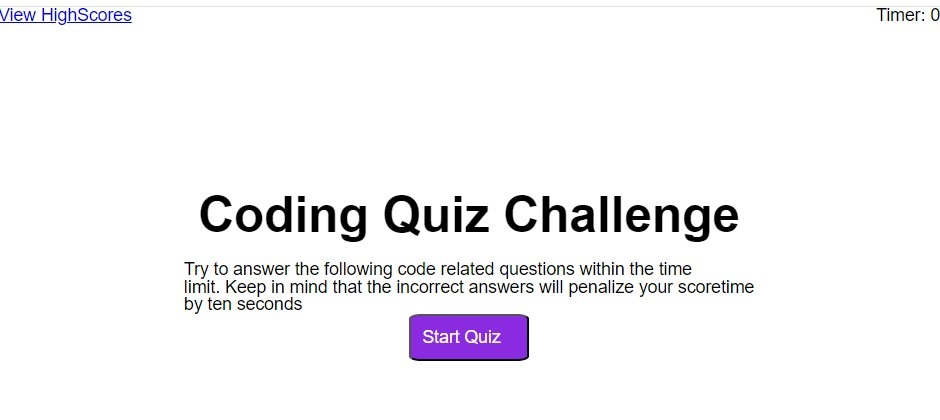
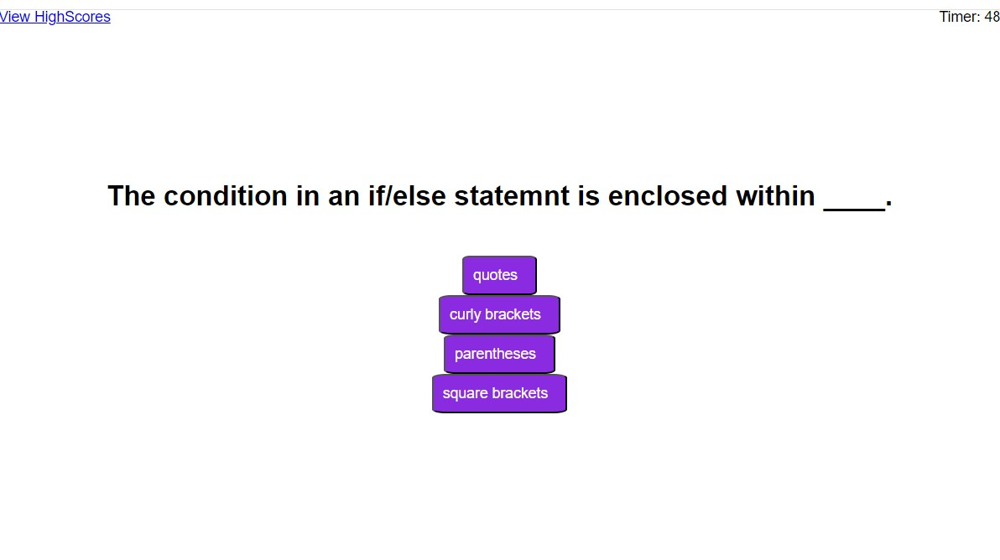
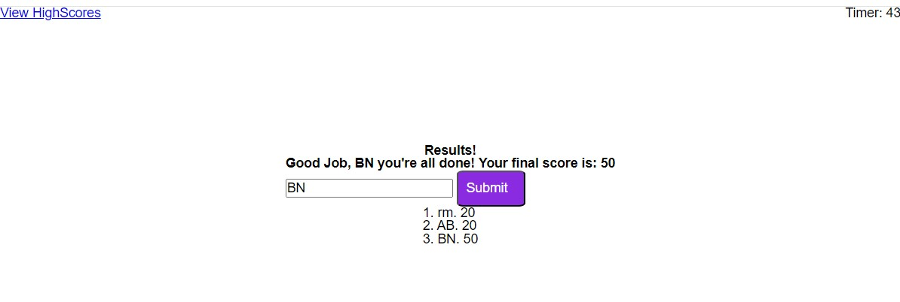

# Quiz Project (https://rmolu11.github.io/mini-project-quiz/)

This is a simple quiz application built using HTML, CSS and Javascript. It allows users to answer multiple-choice questions and provide feedback on their answers.

## Features
- MCQs with options
- Immeediate feedback concerning the correctness of the choice made.
- Keeping track of user's score
- Ability to restart the quiz (refresh)

## Installation

1. Clone the repository to your local machine, https://github.com/ralphmolu/mini-project-quiz
 
2. Open the project directory in your code editor.

## Usage
1. Open `index.html` in a web browser.

2. Start answering the questions.

3. After answering all questions, view your final score and the leaderboard.

4. To restart the quiz, refresh the page.

## Contributing
Contributions are welcome! If you'd like to contribute to this project, please follow these steps:
1. Fork the repository.
2. Create a new branch (`git checkout -b feature/your-feature-name`).
3. Make your changes.
4. Commit your changes (`git commit -am 'Add new feature'`).
5. Push to the branch (`git push origin feature/your-feature-name`).
6. Create a new Pull Request.

## License
This project is licensed under the MIT License

## Contact
If you have any questions or suggestions, feel free to contact me at rmolu11@gmail.com

